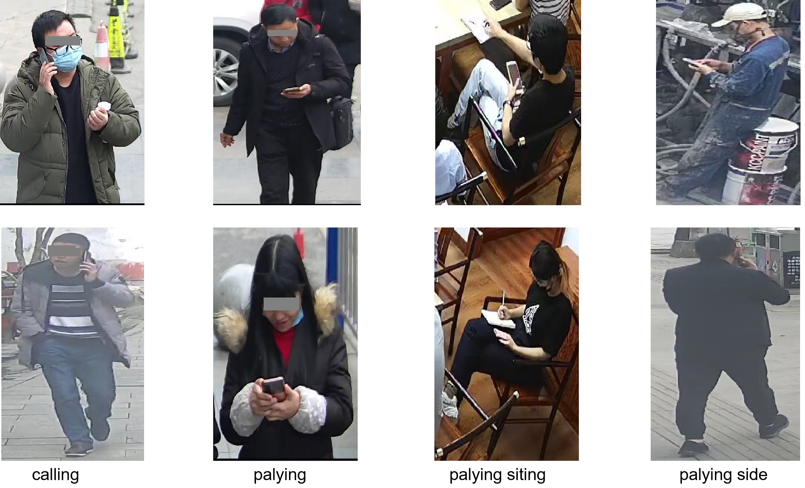

# MoPho-Det

**Dataset for Mobile Phone Usage Behavior Detection. The Original Dataset Description is from [DataFountain Competition 506](https://www.datafountain.cn/competitions/506). New Dataset Description Paper is at (under uploading)**

## Dataset Overview

We are pleased to announce the open sourcing of the **MoPho-Det** dataset. This dataset is specifically designed for detecting mobile phone usage behavior from surveillance perspectives.

- **Total Number of Images**: 22,879
- **Total Number of Annotations**: 39,534
  - **Head Annotations**: 29,279
  - **Phone Annotations**: 10,255

### Dataset Features

1. **Head Annotations**: The dataset includes additional annotations for heads, enhancing the accuracy of detecting users engaged with mobile phones.
2. **Data Cleaning and Correction**: Original dataset has been cleaned and corrected, ensuring high data quality for subsequent research and development.
3. **Professional Applications**: Suitable for precise detection of user mobile phone behavior and supports distance-based hard sample mining.

## Download and Usage

The dataset is available at: [Download Link](https://pan.baidu.com/s/1qq1MkXQIzcvaEe8V8LpQYQ?pwd=dan9)  
**Access Code**: dan9

## License

This dataset is licensed under the [MIT License](LICENSE).

## Contribution

We welcome suggestions, feedback, and code contributions! If you have any questions or suggestions, please submit an issue via GitHub.

## Contact Us

For further information, please contact:

- **Email**: W_ngti_n@foxmail.com

Thank you for your support and interest!
